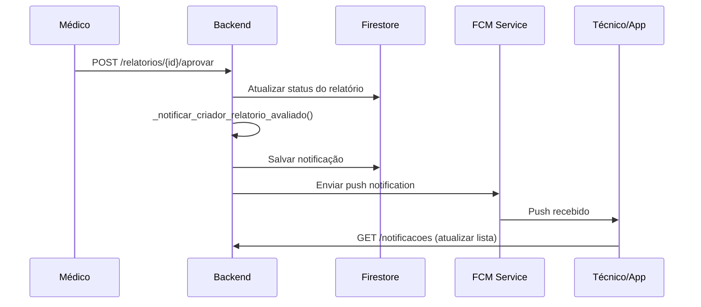
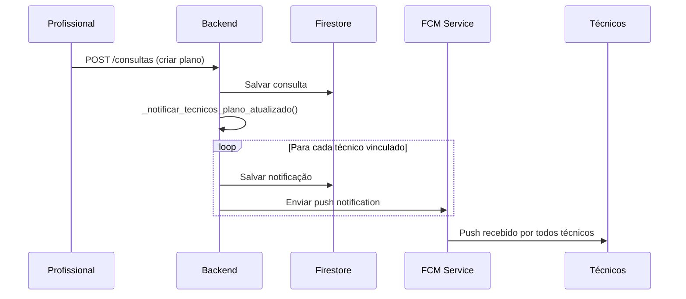
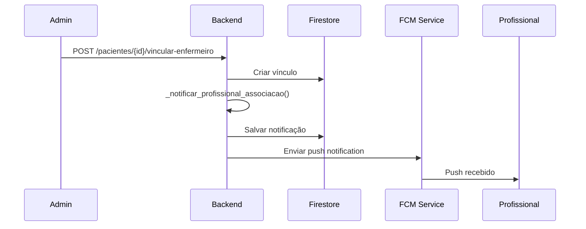

# 📱 Relatório Completo do Sistema de Notificações

## 📋 Índice

1. [Visão Geral](#visão-geral)
2. [Arquitetura do Sistema](#arquitetura-do-sistema)
3. [Tipos de Notificações](#tipos-de-notificações)
4. [Endpoints da API](#endpoints-da-api)
5. [Integração com Frontend](#integração-com-frontend)
6. [Firebase Cloud Messaging (FCM)](#firebase-cloud-messaging-fcm)
7. [Estrutura dos Dados](#estrutura-dos-dados)
8. [Fluxos de Negócio](#fluxos-de-negócio)
9. [Implementação Técnica](#implementação-técnica)
10. [Guia de Uso para o Frontend](#guia-de-uso-para-o-frontend)

---

## 🎯 Visão Geral

O sistema de notificações foi projetado para manter os usuários informados sobre eventos importantes no fluxo clínico, incluindo:

- **Avaliações de relatórios médicos**
- **Atualizações de planos de cuidado**
- **Associações de profissionais a pacientes**
- **Conclusão de checklists diários**
- **Agendamentos e cancelamentos**

### ✨ Características Principais

- ✅ **Push Notifications** via Firebase Cloud Messaging (FCM)
- ✅ **Persistência** no Firestore com histórico completo
- ✅ **Sistema anti-spam** com deduplicação
- ✅ **Notificações direcionadas** por tipo de usuário
- ✅ **Estados de leitura** (lida/não lida)
- ✅ **Agendamento** de notificações futuras

---

## 🏗️ Arquitetura do Sistema

```mermaid
graph TB
    A[Evento do Sistema] --> B[Função Helper de Notificação]
    B --> C[Persistir no Firestore]
    B --> D[Enviar via FCM]
    C --> E[Coleção usuarios/{id}/notificacoes]
    D --> F[App do Usuário]
    F --> G[Exibir Notificação]
    
    H[Frontend] --> I[Registrar FCM Token]
    I --> J[Coleção usuarios - campo fcm_tokens]
    
    K[Notificações Agendadas] --> L[Coleção notificacoes_agendadas]
    L --> M[Worker/Scheduler Futuro]
```

### 📁 Estrutura no Firestore

```
usuarios/
├── {usuario_id}/
│   ├── fcm_tokens: [array de tokens]
│   └── notificacoes/
│       ├── {notificacao_id}/
│       │   ├── title: string
│       │   ├── body: string
│       │   ├── tipo: string
│       │   ├── lida: boolean
│       │   ├── data_criacao: timestamp
│       │   ├── relacionado: object
│       │   └── dedupe_key: string
│       └── ...
└── ...

notificacoes_agendadas/
├── {agendamento_id}/
│   ├── paciente_id: string
│   ├── titulo: string
│   ├── mensagem: string
│   ├── data_agendamento: timestamp
│   ├── status: "agendada"
│   └── criado_por_uid: string
└── ...
```

---

## 🔔 Tipos de Notificações

### 1. **Avaliação de Relatório Médico**
**Trigger:** Aprovação ou recusa de relatório pelo médico  
**Destinatário:** Criador do relatório (técnico/enfermeiro)  
**Função:** `_notificar_criador_relatorio_avaliado()`

```json
{
  "tipo": "RELATORIO_AVALIADO",
  "title": "Relatório Aprovado",
  "body": "Seu relatório sobre João Silva foi aprovado pelo Dr. Carlos",
  "relacionado": {
    "relatorio_id": "abc123",
    "paciente_nome": "João Silva",
    "status": "aprovado"
  }
}
```

### 2. **Novo Plano de Cuidado**
**Trigger:** Criação de nova consulta com plano  
**Destinatário:** Todos os técnicos vinculados ao paciente  
**Função:** `_notificar_tecnicos_plano_atualizado()`

```json
{
  "tipo": "PLANO_ATUALIZADO",
  "title": "Novo Plano de Cuidado",
  "body": "Plano de cuidado atualizado para Maria Santos",
  "relacionado": {
    "consulta_id": "def456",
    "paciente_nome": "Maria Santos"
  }
}
```

### 3. **Associação de Profissional**
**Trigger:** Vinculação de enfermeiro ou técnico a paciente  
**Destinatário:** Profissional sendo associado  
**Função:** `_notificar_profissional_associacao()`

```json
{
  "tipo": "ASSOCIACAO_PROFISSIONAL",
  "title": "Nova Responsabilidade",
  "body": "Você foi designado como enfermeiro responsável por Pedro Lima",
  "relacionado": {
    "paciente_id": "ghi789",
    "paciente_nome": "Pedro Lima",
    "tipo_profissional": "enfermeiro"
  }
}
```

### 4. **Checklist Concluído**
**Trigger:** Checklist diário atingindo 100% de conclusão  
**Destinatário:** Enfermeiro responsável pelo paciente  
**Função:** `_verificar_checklist_completo()` + `_notificar_checklist_concluido()`

```json
{
  "tipo": "CHECKLIST_CONCLUIDO",
  "title": "Checklist Concluído",
  "body": "Ana Costa completou 100% do checklist diário",
  "relacionado": {
    "paciente_id": "jkl012",
    "paciente_nome": "Ana Costa",
    "data_checklist": "2025-09-11"
  }
}
```

### 5. **Notificações de Agendamento**
**Trigger:** Novo agendamento ou cancelamento  
**Destinatário:** Profissional ou cliente envolvido  
**Funções:** Integradas no sistema de agendamentos

---

## 🛠️ Endpoints da API

### **1. Listar Notificações**
```http
GET /notificacoes
Authorization: Bearer {firebase_token}
```

**Resposta:**
```json
[
  {
    "id": "notif_123",
    "title": "Relatório Aprovado",
    "body": "Seu relatório foi aprovado pelo Dr. Carlos",
    "lida": false,
    "data_criacao": "2025-09-11T10:30:00Z",
    "tipo": "RELATORIO_AVALIADO",
    "relacionado": {
      "relatorio_id": "rel_456",
      "paciente_nome": "João Silva"
    }
  }
]
```

### **2. Contar Notificações Não Lidas**
```http
GET /notificacoes/nao-lidas/contagem
Authorization: Bearer {firebase_token}
```

**Resposta:**
```json
{
  "count": 5
}
```

### **3. Marcar Todas Como Lidas**
```http
POST /notificacoes/ler-todas
Authorization: Bearer {firebase_token}
```

**Resposta:** `204 No Content`

### **4. Marcar Uma Como Lida**
```http
POST /notificacoes/marcar-como-lida
Authorization: Bearer {firebase_token}
Content-Type: application/json

{
  "notificacao_id": "notif_123"
}
```

**Resposta:** `204 No Content`

### **5. Agendar Notificação**
```http
POST /notificacoes/agendar
Authorization: Bearer {firebase_token}
negocio-id: {negocio_id}
Content-Type: application/json

{
  "paciente_id": "user_789",
  "titulo": "Lembrete de Medicação",
  "mensagem": "Não esqueça de tomar seus medicamentos às 18h",
  "data_agendamento": "2025-09-12T18:00:00Z"
}
```

**Resposta:**
```json
{
  "id": "agenda_456",
  "paciente_id": "user_789",
  "titulo": "Lembrete de Medicação",
  "mensagem": "Não esqueça de tomar seus medicamentos às 18h",
  "data_agendamento": "2025-09-12T18:00:00Z",
  "status": "agendada",
  "criado_em": "2025-09-11T14:30:00Z",
  "criado_por_uid": "prof_uid_123"
}
```

### **6. Registrar Token FCM**
```http
POST /usuarios/register-fcm-token
Authorization: Bearer {firebase_token}
Content-Type: application/json

{
  "fcm_token": "eH7fKc9q3R:APA91bF..."
}
```

**Resposta:** `200 OK`

---

## 📱 Firebase Cloud Messaging (FCM)

### **Configuração no Frontend**

1. **Inicializar Firebase SDK**
```javascript
import { initializeApp } from 'firebase/app';
import { getMessaging, getToken } from 'firebase/messaging';

const app = initializeApp(firebaseConfig);
const messaging = getMessaging(app);
```

2. **Solicitar Permissão e Obter Token**
```javascript
async function requestPermissionAndGetToken() {
  try {
    const permission = await Notification.requestPermission();
    if (permission === 'granted') {
      const token = await getToken(messaging, {
        vapidKey: 'YOUR_VAPID_KEY'
      });
      
      // Enviar token para o backend
      await registerFCMToken(token);
      return token;
    }
  } catch (error) {
    console.error('Erro ao obter token FCM:', error);
  }
}
```

3. **Registrar Token no Backend**
```javascript
async function registerFCMToken(token) {
  await fetch('/usuarios/register-fcm-token', {
    method: 'POST',
    headers: {
      'Authorization': `Bearer ${firebaseIdToken}`,
      'Content-Type': 'application/json'
    },
    body: JSON.stringify({ fcm_token: token })
  });
}
```

4. **Escutar Mensagens em Foreground**
```javascript
import { onMessage } from 'firebase/messaging';

onMessage(messaging, (payload) => {
  console.log('Mensagem recebida em foreground:', payload);
  
  // Exibir notificação customizada
  showCustomNotification(payload.notification);
  
  // Atualizar contador de não lidas
  updateNotificationBadge();
});
```

### **Service Worker (firebase-messaging-sw.js)**
```javascript
importScripts('https://www.gstatic.com/firebasejs/9.0.0/firebase-app-compat.js');
importScripts('https://www.gstatic.com/firebasejs/9.0.0/firebase-messaging-compat.js');

firebase.initializeApp({
  // Sua configuração do Firebase
});

const messaging = firebase.messaging();

messaging.onBackgroundMessage((payload) => {
  console.log('Mensagem em background:', payload);
  
  const notificationTitle = payload.notification.title;
  const notificationOptions = {
    body: payload.notification.body,
    icon: '/firebase-logo.png',
    badge: '/badge-icon.png',
    data: payload.data
  };

  self.registration.showNotification(notificationTitle, notificationOptions);
});
```

---

## 🎨 Integração com Frontend

### **1. Hook React para Notificações**
```typescript
interface Notification {
  id: string;
  title: string;
  body: string;
  lida: boolean;
  data_criacao: string;
  tipo?: string;
  relacionado?: Record<string, any>;
}

export const useNotifications = () => {
  const [notifications, setNotifications] = useState<Notification[]>([]);
  const [unreadCount, setUnreadCount] = useState(0);
  const [loading, setLoading] = useState(true);

  const fetchNotifications = async () => {
    try {
      const response = await fetch('/notificacoes', {
        headers: { 'Authorization': `Bearer ${token}` }
      });
      const data = await response.json();
      setNotifications(data);
    } catch (error) {
      console.error('Erro ao buscar notificações:', error);
    } finally {
      setLoading(false);
    }
  };

  const fetchUnreadCount = async () => {
    try {
      const response = await fetch('/notificacoes/nao-lidas/contagem', {
        headers: { 'Authorization': `Bearer ${token}` }
      });
      const { count } = await response.json();
      setUnreadCount(count);
    } catch (error) {
      console.error('Erro ao buscar contagem:', error);
    }
  };

  const markAsRead = async (notificationId: string) => {
    try {
      await fetch('/notificacoes/marcar-como-lida', {
        method: 'POST',
        headers: {
          'Authorization': `Bearer ${token}`,
          'Content-Type': 'application/json'
        },
        body: JSON.stringify({ notificacao_id: notificationId })
      });
      
      // Atualizar estado local
      setNotifications(prev => 
        prev.map(n => n.id === notificationId ? { ...n, lida: true } : n)
      );
      setUnreadCount(prev => Math.max(0, prev - 1));
    } catch (error) {
      console.error('Erro ao marcar como lida:', error);
    }
  };

  const markAllAsRead = async () => {
    try {
      await fetch('/notificacoes/ler-todas', {
        method: 'POST',
        headers: { 'Authorization': `Bearer ${token}` }
      });
      
      setNotifications(prev => prev.map(n => ({ ...n, lida: true })));
      setUnreadCount(0);
    } catch (error) {
      console.error('Erro ao marcar todas como lidas:', error);
    }
  };

  useEffect(() => {
    fetchNotifications();
    fetchUnreadCount();
  }, []);

  return {
    notifications,
    unreadCount,
    loading,
    markAsRead,
    markAllAsRead,
    refetch: () => {
      fetchNotifications();
      fetchUnreadCount();
    }
  };
};
```

### **2. Componente de Lista de Notificações**
```typescript
export const NotificationList: React.FC = () => {
  const { notifications, unreadCount, markAsRead, markAllAsRead } = useNotifications();

  const handleNotificationClick = (notification: Notification) => {
    if (!notification.lida) {
      markAsRead(notification.id);
    }
    
    // Navegar para tela relacionada baseado no tipo
    switch (notification.tipo) {
      case 'RELATORIO_AVALIADO':
        navigate(`/relatorios/${notification.relacionado?.relatorio_id}`);
        break;
      case 'PLANO_ATUALIZADO':
        navigate(`/pacientes/${notification.relacionado?.paciente_id}/plano`);
        break;
      case 'ASSOCIACAO_PROFISSIONAL':
        navigate(`/pacientes/${notification.relacionado?.paciente_id}`);
        break;
      case 'CHECKLIST_CONCLUIDO':
        navigate(`/pacientes/${notification.relacionado?.paciente_id}/checklist`);
        break;
      default:
        console.log('Tipo de notificação desconhecido:', notification.tipo);
    }
  };

  return (
    <div className="notification-list">
      <div className="notification-header">
        <h3>Notificações {unreadCount > 0 && <span className="badge">{unreadCount}</span>}</h3>
        {unreadCount > 0 && (
          <button onClick={markAllAsRead} className="mark-all-read">
            Marcar todas como lidas
          </button>
        )}
      </div>
      
      <div className="notification-items">
        {notifications.map(notification => (
          <div 
            key={notification.id}
            className={`notification-item ${!notification.lida ? 'unread' : ''}`}
            onClick={() => handleNotificationClick(notification)}
          >
            <div className="notification-content">
              <h4>{notification.title}</h4>
              <p>{notification.body}</p>
              <span className="timestamp">
                {formatDistanceToNow(new Date(notification.data_criacao))} atrás
              </span>
            </div>
            {!notification.lida && <div className="unread-indicator" />}
          </div>
        ))}
      </div>
    </div>
  );
};
```

### **3. Badge de Notificações**
```typescript
export const NotificationBadge: React.FC = () => {
  const { unreadCount } = useNotifications();

  return (
    <div className="notification-badge-container">
      <BellIcon className="bell-icon" />
      {unreadCount > 0 && (
        <span className="notification-badge">
          {unreadCount > 99 ? '99+' : unreadCount}
        </span>
      )}
    </div>
  );
};
```

---

## ⚙️ Fluxos de Negócio

### **Fluxo 1: Avaliação de Relatório**


### **Fluxo 2: Novo Plano de Cuidado**


### **Fluxo 3: Associação de Profissional**


---

## 💾 Estrutura dos Dados

### **Schema de Notificação**
```typescript
interface NotificacaoFirestore {
  title: string;           // Título da notificação
  body: string;            // Corpo da mensagem
  tipo: string;            // Tipo da notificação (enum)
  lida: boolean;           // Status de leitura
  data_criacao: Timestamp; // Data de criação
  relacionado?: {          // Dados relacionados
    [key: string]: any;
  };
  dedupe_key: string;      // Chave para evitar duplicatas
}
```

### **Tipos de Notificação (Enum)**
```typescript
enum TipoNotificacao {
  RELATORIO_AVALIADO = 'RELATORIO_AVALIADO',
  PLANO_ATUALIZADO = 'PLANO_ATUALIZADO', 
  ASSOCIACAO_PROFISSIONAL = 'ASSOCIACAO_PROFISSIONAL',
  CHECKLIST_CONCLUIDO = 'CHECKLIST_CONCLUIDO',
  NOVO_AGENDAMENTO = 'NOVO_AGENDAMENTO',
  AGENDAMENTO_CANCELADO = 'AGENDAMENTO_CANCELADO',
  LEMBRETE_PERSONALIZADO = 'LEMBRETE_PERSONALIZADO'
}
```

### **Payload FCM**
```json
{
  "notification": {
    "title": "Relatório Aprovado",
    "body": "Seu relatório sobre João Silva foi aprovado"
  },
  "data": {
    "tipo": "RELATORIO_AVALIADO",
    "relatorio_id": "rel_123",
    "paciente_id": "pac_456",
    "click_action": "/relatorios/rel_123"
  },
  "tokens": ["token1", "token2", "token3"]
}
```

---

## 🔧 Implementação Técnica

### **Funções Helper Principais**

#### **1. _notificar_criador_relatorio_avaliado()**
```python
def _notificar_criador_relatorio_avaliado(db: firestore.client, relatorio: Dict, status: str):
    """Notifica o criador do relatório sobre aprovação/recusa pelo médico."""
    # Local: crud.py:4235
    # Trigger: aprovar_relatorio() e recusar_relatorio()
    # Destinatário: Usuário que criou o relatório
```

#### **2. _notificar_tecnicos_plano_atualizado()**
```python
def _notificar_tecnicos_plano_atualizado(db: firestore.client, paciente_id: str, consulta_id: str):
    """Notifica todos os técnicos vinculados sobre novo plano de cuidado."""
    # Local: crud.py:4311
    # Trigger: criar_consulta()
    # Destinatários: Todos os técnicos vinculados ao paciente
```

#### **3. _notificar_profissional_associacao()**
```python
def _notificar_profissional_associacao(db: firestore.client, profissional_id: str, paciente_id: str, tipo_profissional: str):
    """Notifica um profissional sobre associação a um paciente."""
    # Local: crud.py:4381
    # Trigger: vincular_paciente_enfermeiro() e vincular_tecnicos_paciente()
    # Destinatário: Profissional sendo associado
```

#### **4. _verificar_checklist_completo()**
```python
def _verificar_checklist_completo(db: firestore.client, paciente_id: str, data_checklist: str):
    """Verifica se o checklist diário está 100% concluído e notifica se necessário."""
    # Local: crud.py:4440
    # Trigger: atualizar_item_checklist_diario()
    # Destinatário: Enfermeiro responsável pelo paciente
```

### **Sistema Anti-Spam**
Cada notificação tem uma `dedupe_key` única para evitar duplicatas:

```python
# Exemplo de dedupe_key
dedupe_key_patterns = {
    "RELATORIO_AVALIADO": f"RELATORIO_{status}_{relatorio_id}",
    "PLANO_ATUALIZADO": f"PLANO_ATUALIZADO_{consulta_id}_{tecnico_id}",
    "ASSOCIACAO_PROFISSIONAL": f"ASSOCIACAO_{profissional_id}_{paciente_id}",
    "CHECKLIST_CONCLUIDO": f"CHECKLIST_{paciente_id}_{data_checklist}"
}
```

### **Limpeza de Tokens Inválidos**
O sistema remove automaticamente tokens FCM inválidos:

```python
except Exception as e:
    if 'invalid-registration-token' in str(e).lower():
        # Remove token inválido
        for token in tokens_fcm:
            remover_fcm_token(db, firebase_uid_destinatario, token)
```

---

## 📚 Guia de Uso para o Frontend

### **Setup Inicial**

1. **Instalar Dependencies**
```bash
npm install firebase
```

2. **Configurar Firebase**
```typescript
// firebase-config.ts
export const firebaseConfig = {
  // Sua configuração
};
```

3. **Inicializar Messaging**
```typescript
// notifications.ts
import { initializeApp } from 'firebase/app';
import { getMessaging } from 'firebase/messaging';
import { firebaseConfig } from './firebase-config';

const app = initializeApp(firebaseConfig);
export const messaging = getMessaging(app);
```

### **Implementação Passo a Passo**

#### **Passo 1: Solicitar Permissão**
```typescript
const requestNotificationPermission = async () => {
  try {
    const permission = await Notification.requestPermission();
    if (permission === 'granted') {
      console.log('Permissão concedida!');
      await setupFCM();
    } else {
      console.log('Permissão negada');
    }
  } catch (error) {
    console.error('Erro ao solicitar permissão:', error);
  }
};
```

#### **Passo 2: Configurar FCM**
```typescript
const setupFCM = async () => {
  try {
    const token = await getToken(messaging, {
      vapidKey: 'YOUR_VAPID_KEY'
    });
    
    if (token) {
      await registerToken(token);
      setupMessageListener();
    }
  } catch (error) {
    console.error('Erro no setup FCM:', error);
  }
};
```

#### **Passo 3: Registrar Token**
```typescript
const registerToken = async (token: string) => {
  const idToken = await user.getIdToken();
  
  await fetch('/usuarios/register-fcm-token', {
    method: 'POST',
    headers: {
      'Authorization': `Bearer ${idToken}`,
      'Content-Type': 'application/json'
    },
    body: JSON.stringify({ fcm_token: token })
  });
};
```

#### **Passo 4: Escutar Mensagens**
```typescript
const setupMessageListener = () => {
  onMessage(messaging, (payload) => {
    console.log('Mensagem recebida:', payload);
    
    // Atualizar lista de notificações
    refetchNotifications();
    
    // Mostrar notificação customizada
    showInAppNotification(payload);
  });
};
```

### **Gerenciamento de Estado**

#### **Context Provider**
```typescript
interface NotificationContextType {
  notifications: Notification[];
  unreadCount: number;
  markAsRead: (id: string) => void;
  markAllAsRead: () => void;
  refetch: () => void;
}

export const NotificationProvider: React.FC<{children: React.ReactNode}> = ({ children }) => {
  // ... implementação do hook useNotifications
  
  return (
    <NotificationContext.Provider value={contextValue}>
      {children}
    </NotificationContext.Provider>
  );
};
```

#### **Uso nos Componentes**
```typescript
export const Header: React.FC = () => {
  const { unreadCount } = useContext(NotificationContext);
  
  return (
    <header>
      <NotificationBell count={unreadCount} />
    </header>
  );
};
```

### **Tratamento de Erros Comuns**

#### **Token Expirado**
```typescript
const handleTokenRefresh = async () => {
  try {
    const newToken = await getToken(messaging);
    await registerToken(newToken);
  } catch (error) {
    console.error('Erro ao renovar token:', error);
  }
};
```

#### **Permissão Revogada**
```typescript
const checkPermissionStatus = () => {
  if (Notification.permission === 'denied') {
    showPermissionDialog();
  } else if (Notification.permission === 'default') {
    requestNotificationPermission();
  }
};
```

---

## ✅ Checklist de Implementação Frontend

### **Configuração Base**
- [ ] Firebase SDK configurado
- [ ] Service Worker registrado
- [ ] Permissões solicitadas
- [ ] Token FCM obtido e registrado

### **Componentes UI**
- [ ] Lista de notificações
- [ ] Badge com contador
- [ ] Modal/popup de notificação
- [ ] Botão "marcar como lida"
- [ ] Botão "marcar todas como lidas"

### **Funcionalidades**
- [ ] Receber push notifications
- [ ] Atualizar contador em tempo real
- [ ] Navegar para tela relacionada ao clicar
- [ ] Persistir estado de leitura
- [ ] Refresh automático da lista

### **Testes**
- [ ] Testar em foreground
- [ ] Testar em background
- [ ] Testar com app fechado
- [ ] Testar com múltiplos tipos
- [ ] Testar navegação

---

## 🎉 Conclusão

O sistema de notificações está completamente implementado e pronto para uso. Ele oferece:

- ✅ **4 tipos automáticos** de notificações críticas
- ✅ **Sistema robusto** com persistência e FCM
- ✅ **API completa** para gerenciamento
- ✅ **Arquitetura escalável** para novos tipos
- ✅ **Documentação completa** para implementação

### **Próximos Passos Sugeridos:**

1. **Implementar Service Worker** para notificações em background
2. **Criar telas específicas** para cada tipo de notificação  
3. **Adicionar analytics** para rastrear engagement
4. **Implementar rich media** (imagens, ações customizadas)
5. **Criar sistema de templates** para personalização

---

**Data do Relatório:** 11 de Setembro de 2025  
**Versão:** 1.0  
**Status:** Implementação Completa ✅